# DevCard

**Auto-generate beautiful, agent-readable developer identity cards from GitHub.**

No sign-up. No LLM. Paste a GitHub username — get a visual card, structured JSON, and terminal output in seconds.


<p align="center">
  
</p>

## Quick Start

```bash
# Install
pip install devcard        # or: uv pip install devcard

# Generate your card
devcard generate karpathy

# Get an SVG for your GitHub README
devcard generate karpathy --format svg --theme dark

# Generate everything (JSON + SVG + terminal)
devcard generate karpathy --format all
```

## What It Extracts

DevCard analyzes public GitHub data to build a structured developer profile:

| Signal | Source | Example |
|--------|--------|---------|
| **Identity** | User profile | Name, bio, location, followers |
| **Languages** | Repo language stats | Python 72%, C 12%, JS 8% |
| **Tech Stack** | Dependency files | PyTorch, FastAPI, PostgreSQL |
| **Activity** | Events + push dates | Active, peak hours, timezone |
| **Top Projects** | Repos ranked by impact | nanoGPT (38k stars), llm.c (25k) |
| **Collaboration** | PRs, issues, orgs | Maintainer style, OpenAI org |
| **Quality** | Repo file structure | CI 80%, tests 60%, docs 90% |
| **Expertise** | Topics + stack + langs | Machine Learning (0.95 confidence) |

All signals are extracted from pure GitHub API data — no LLM, no scraping, fully deterministic.

## Themes

<table>
<tr>
<td align="center"><strong>Default</strong></td>
<td align="center"><strong>Dark</strong></td>
</tr>
<tr>
<td></td>
<td></td>
</tr>
<tr>
<td align="center"><strong>Minimal</strong></td>
<td align="center"><strong>Neon</strong></td>
</tr>
<tr>
<td></td>
<td></td>
</tr>
<tr>
<td align="center" colspan="2"><strong>Terminal Green</strong></td>
</tr>
<tr>
<td colspan="2" align="center"></td>
</tr>
</table>

## Output Formats

```bash
devcard generate <username> --format terminal   # Rich terminal panels (default)
devcard generate <username> --format json        # Structured devcard.json
devcard generate <username> --format yaml        # Human-friendly YAML
devcard generate <username> --format svg         # Embeddable SVG card
devcard generate <username> --format all         # Everything at once
```

## The devcard.json Schema

Every DevCard produces a `devcard.json` — a structured, agent-readable profile. Every field has a `description` so AI agents understand the semantics without documentation.

```json
{
  "$schema": "https://devcard.dev/schema/v1",
  "version": "1.0",
  "identity": {
    "username": "karpathy",
    "name": "Andrej Karpathy",
    "bio": "I like to train neural nets",
    "followers": 95000
  },
  "languages": [
    { "name": "Python", "percentage": 72.3, "color": "#3572A5" }
  ],
  "expertise": {
    "domains": [
      { "name": "Machine Learning", "confidence": 1.0 }
    ],
    "profile_type": "ml"
  }
}
```

The full schema is at [`schema/devcard.v1.schema.json`](schema/devcard.v1.schema.json). See complete examples in [`schema/examples/`](schema/examples/).

**Why a schema?** DevCard is a protocol, not just a CLI. The JSON output is designed to be consumed by AI agents, portfolio builders, hiring tools, or any system that needs structured developer data. The visual card drives adoption; the schema is the real product.

## Commands

### `devcard generate <username>`

Generate a DevCard for any public GitHub user.

```bash
devcard generate torvalds                          # Terminal output
devcard generate torvalds --format svg --theme dark # Dark SVG card
devcard generate torvalds --format json -o out.json # Save JSON to file
devcard generate torvalds --token ghp_xxx           # Authenticated (5000 req/hr)
devcard generate torvalds --no-cache                # Skip cache
```

### `devcard validate <file>`

Validate a `devcard.json` against the schema.

```bash
devcard validate my-devcard.json
```

### `devcard me`

Generate a DevCard for your own GitHub account (detected via `gh` CLI).

```bash
devcard me --format svg --theme neon
```

## Add DevCard to Your GitHub Profile

1. Generate your SVG:
   ```bash
   devcard generate YOUR_USERNAME --format svg --theme dark -o devcard.svg
   ```

2. Add `devcard.svg` to your profile repo (`YOUR_USERNAME/YOUR_USERNAME`)

3. Reference it in your `README.md`:
   ```markdown
   <p align="center">
     
   </p>
   ```

## GitHub Token

Without a token, GitHub's API allows 60 requests/hour. A single DevCard generation needs ~65-100 calls. **Set a token for reliable use:**

```bash
# Option 1: Environment variable
export GITHUB_TOKEN=ghp_your_token_here
devcard generate karpathy

# Option 2: CLI flag
devcard generate karpathy --token ghp_your_token_here

# Option 3: GitHub CLI (auto-detected)
gh auth login
devcard generate karpathy
```

Create a token at [github.com/settings/tokens](https://github.com/settings/tokens) — no special scopes needed, just public repo read access.

## Contributing

Contributions are welcome! Here are the easiest ways to help:

### Add dependency mappings

Know a popular package we're missing? Edit [`mappings/dependencies.yaml`](mappings/dependencies.yaml):

```yaml
python:
  my-package: { category: "framework", name: "My Package" }
```

Categories: `framework`, `library`, `database`, `tool`, `platform`, `ci_cd`, `testing`, `other`

### Add a theme

Create a new file in `src/devcard/renderers/themes/`:

```python
from devcard.renderers.themes.base import Theme

THEME = Theme(
    name="my-theme",
    background="#...",
    foreground="#...",
    secondary="#...",
    accent="#...",
    border="#...",
)
```

### Architecture

```
CLI (typer) --> Pipeline
                 |-- GitHub Client (async httpx, cached, rate-limited)
                 |-- Extractors (identity, languages, stack, activity, projects, collaboration, quality, expertise)
                 |-- Analyzers (developer type, project classifier, contribution style, scoring)
                 |-- Renderers (terminal, SVG, JSON, YAML)
```

Key principle: Extractors return `None` on failure — the pipeline assembles whatever data it can. A DevCard with just an identity section is valid.

## Roadmap

- [ ] Web app — connect GitHub, generate your card, share a link
- [ ] GitHub Action — auto-update your DevCard SVG on push
- [ ] MCP server — let AI agents query DevCards programmatically
- [ ] PNG export — for social sharing
- [ ] `devcard compare` — side-by-side developer comparison
- [ ] More themes — community-contributed visual styles

## License

[Apache 2.0](LICENSE)
