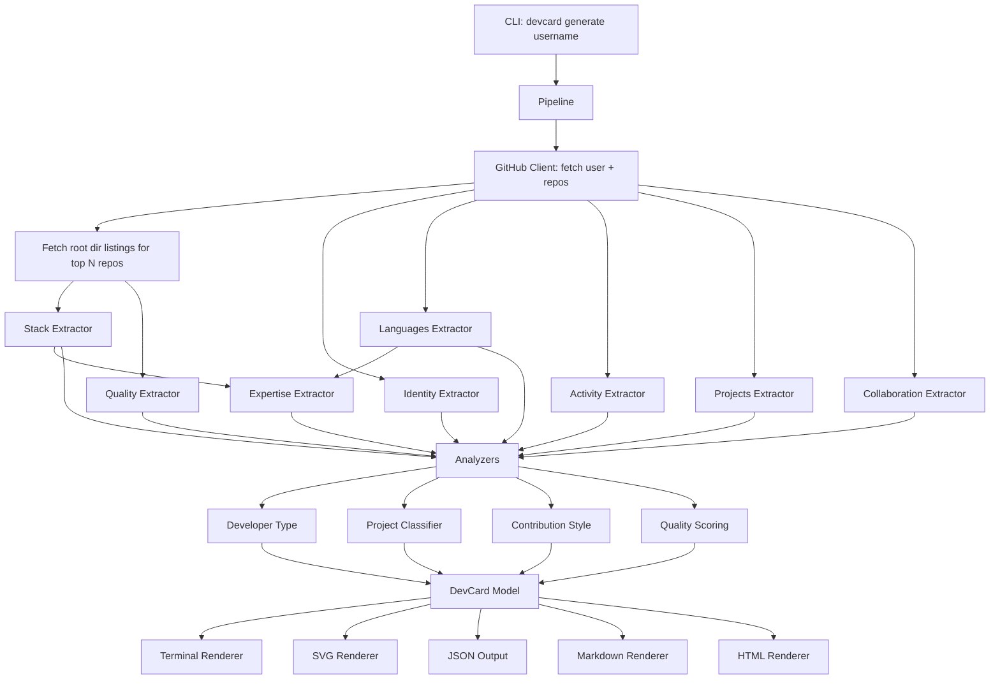

# DevCard Data Flow

## Pipeline Stages

## API Call Budget

For a user with N repos (capped at `max_repos`, default 30):
- 1 call: user profile
- 1-3 calls: repos list (paginated)
- N calls: languages per repo
- N calls: root directory listing per repo (shared by stack + quality extractors)
- 1 call: user events (last 300)
- 1 call: user orgs
- Selective calls: dependency file contents (only when dep files found in root listing)

**Total estimate**: ~65-100 calls for a 30-repo user. Well within 5000/hr authenticated limit. Without auth (60/hr), a single generation may exhaust the budget.

## Concurrency Model

- `asyncio.Semaphore(10)` gates all GitHub API requests
- Independent extractors run concurrently via `asyncio.gather`
- Within an extractor, per-repo fetches run concurrently (using the shared semaphore)
- Dependent extractors (expertise) wait for their dependencies (stack, languages)
- All caching happens at the HTTP layer (diskcache), transparent to extractors
